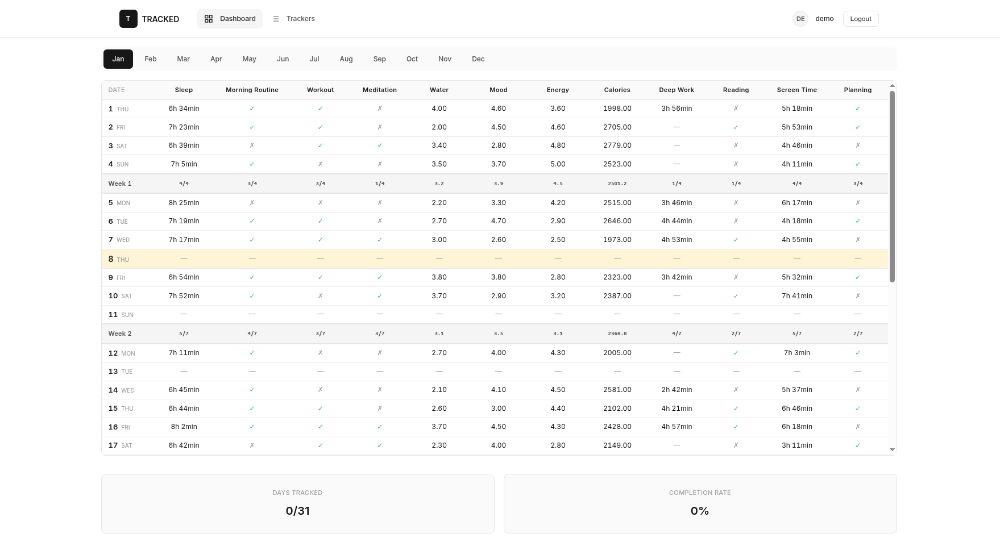

# TRACKED

A minimalist habit and life tracking application built with Django. Track what matters with a clean, Excel-like interface designed for serious professionals, athletes, and entrepreneurs.



## Features

- **Excel-like Grid Interface** - Familiar spreadsheet layout for quick data entry
- **Custom Trackers** - Create trackers for anything: sleep, mood, workouts, water intake, etc.
- **Multiple Data Types** - Binary (Yes/No), Numbers, Time, and Duration tracking
- **Weekly Summaries** - Automatic statistics and completion rates per week
- **Clean Design** - Minimal, distraction-free interface with professional aesthetics
- **Responsive** - Works on desktop and mobile devices
- **Today Highlighting** - Current day automatically highlighted for quick reference

## Tech Stack

- **Backend:** Django 5.2
- **Database:** PostgreSQL
- **Frontend:** HTML, CSS (Vanilla), JavaScript
- **Design:** Custom design system with Inter font
- **Deployment:** Railway (ready)

## Installation

### Prerequisites

- Python 3.12+
- PostgreSQL
- pip and virtualenv

### Local Setup

1. **Clone the repository**
```bash
git clone https://github.com/zohirhamid/tracked-app.git
cd tracked-app
```

2. **Create virtual environment**
```bash
python -m venv venv
source venv/bin/activate  # On Windows: venv\Scripts\activate
```

3. **Install dependencies**
```bash
pip install -r requirements.txt
```

4. **Set up environment variables**
```bash
cp .env.example .env
# Edit .env with your database credentials
```

5. **Run migrations**
```bash
python manage.py migrate
```

6. **Create superuser**
```bash
python manage.py createsuperuser
```

7. **Run development server**
```bash
python manage.py runserver
```

Visit `http://localhost:8000` to see the app.

## Usage

### Creating Trackers

1. Navigate to "Trackers" in the navigation bar
2. Click "Add Tracker"
3. Choose:
   - **Name:** What you're tracking (e.g., "Sleep", "Workout")
   - **Type:** Binary, Number, Time, or Duration
   - **Unit:** Optional unit (e.g., "hours", "L", "/5")
   - **Display Order:** Controls column order in the grid

### Tracking Data

1. Click on any cell in the monthly grid
2. Enter your data in the modal
3. Press Enter or click Save
4. Data is automatically saved via AJAX

### Tracker Types

- **Binary (Yes/No):** Perfect for habits like "Worked out", "Meditated"
- **Number:** Track quantities like mood ratings, calories, steps
- **Time:** Single time values like "Wake up time"
- **Duration:** Start and end times like "Sleep: 23:00 - 06:30"

## Project Structure
```
tracked-app/
├── config/              # Django project settings
├── tracker/             # Main app
│   ├── models.py        # Database models
│   ├── views.py         # View logic
│   ├── urls.py          # URL routing
│   └── templatetags/    # Custom template filters
├── templates/           # HTML templates
│   ├── base.html
│   ├── tracker/         # Tracker-specific templates
│   └── registration/    # Auth templates
├── static/              # Static files
│   ├── css/
│   │   ├── base.css     # Design system
│   │   ├── components.css
│   │   └── grid.css     # Grid-specific styles
│   └── js/
│       ├── main.js
│       ├── grid-editor.js
│       └── ajax-handler.js
└── requirements.txt
```

## Design Philosophy

TRACKED is built for people who value:
- **Minimalism:** Clean interface, no distractions
- **Speed:** Quick data entry, keyboard shortcuts
- **Clarity:** All your data at a glance
- **Privacy:** Your data stays yours

The design is inspired by professional tools with a monochrome aesthetic and subtle yellow accent for today's date.

## Database Schema

### Models

**User** (Django built-in)
- Standard authentication

**Profile**
- One-to-one with User
- Avatar and OAuth data

**Tracker**
- User's tracking categories
- Configurable type and display order

**DailySnapshot**
- Container for one day's entries
- Groups all tracking for a date

**Entry**
- Individual tracking data point
- Links to Tracker and DailySnapshot
- Type-specific value fields

## API Endpoints

- `GET /` - Redirects to current month
- `GET /{year}/{month}/` - Month view grid
- `GET /trackers/` - List all trackers
- `POST /trackers/create/` - Create new tracker
- `POST /entry/save/` - Save entry (AJAX)
- `POST /login/` - User authentication
- `POST /signup/` - User registration

## Contributing

This is a personal project, but suggestions and bug reports are welcome!

1. Fork the repository
2. Create your feature branch (`git checkout -b feature/AmazingFeature`)
3. Commit your changes (`git commit -m 'Add some AmazingFeature'`)
4. Push to the branch (`git push origin feature/AmazingFeature`)
5. Open a Pull Request

## Roadmap

- [ ] Data export (CSV/Excel)
- [ ] Import from existing Excel sheets
- [ ] Charts and visualizations
- [ ] Goal setting and reminders
- [ ] Mobile app
- [ ] Dark mode
- [ ] Sharing and collaboration

## License

This project is licensed under the MIT License - see the LICENSE file for details.

## Acknowledgments

- Design inspired by Linear and professional productivity tools
- Built with love for serious habit trackers
- Special thanks to the Django community

## Contact

Your Name - [@yourtwitter](https://twitter.com/zohirhamid)

Project Link: [https://github.com/zohirhamid/tracked-app](https://github.com/zohirhamid/tracked-app)

---

**TRACKED** - If it matters, track it.