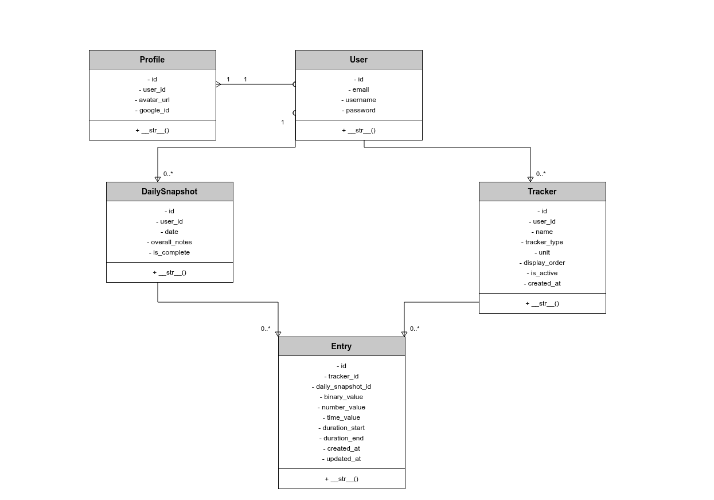

# TRACKED

Frustrated with complex habit tracking apps, I built TRACKED to bring the simplicity of Excel spreadsheets to daily habit tracking. This full-stack Django application serves professionals who value speed and clarity over gamification.


## Features

- **Excel-like Grid Interface** - Familiar spreadsheet layout for quick data entry
- **Custom Trackers** - Create trackers for anything: sleep, mood, workouts, water intake, etc.
- **Multiple Data Types** - Binary (Yes/No), Numbers, Time, and Duration tracking
- **Weekly Summaries** - Automatic statistics and completion rates per week
- **Clean Design** - Minimal, distraction-free interface with professional aesthetics
- **Responsive** - Works on desktop and mobile devices
- **Today Highlighting** - Current day automatically highlighted for quick reference
- **Pro Subscriptions** - Stripe-powered subscriptions for unlimited habits

## Tech Stack

- **Backend:** Django 5.2
- **Database:** PostgreSQL
- **Frontend:** HTML, CSS (Vanilla), JavaScript
- **Payments:** Stripe (Checkout, Webhooks, Customer Portal)
- **Design:** Custom design system with Inter font
- **Deployment:** Railway (ready)

## Installation

### Prerequisites

- Python 3.12+
- PostgreSQL
- pip and virtualenv
- Stripe CLI (for local webhook testing)

### Local Setup

1. **Clone the repository**
```bash
git clone https://github.com/zohirhamid/tracked-app.git
cd tracked-app
```

2. **Create virtual environment**
```bash
python -m venv venv
source venv/bin/activate  # On Windows: venv\Scripts\activate
```

3. **Install dependencies**
```bash
pip install -r requirements.txt
```

4. **Set up environment variables**
```bash
cp .env.example .env
# Edit .env with your credentials
```

Required environment variables:
```
SECRET_KEY=your-secret-key
DEBUG=True

# Database
DATABASE_URL=postgres://...

# Stripe
STRIPE_SECRET_KEY=sk_test_xxx
STRIPE_PUBLISHABLE_KEY=pk_test_xxx
STRIPE_WEBHOOK_SECRET=whsec_xxx
STRIPE_PRICE_PRO_MONTHLY=price_xxx
STRIPE_PRICE_PRO_YEARLY=price_xxx
```

5. **Run migrations**
```bash
python manage.py migrate
```

6. **Create superuser**
```bash
python manage.py createsuperuser
```

7. **Run development server**
```bash
python manage.py runserver
```

8. **Run Stripe CLI (separate terminal)**
```bash
stripe listen --forward-to localhost:8000/payments/webhook/
```
Copy the webhook secret it displays and add to your `.env` as `STRIPE_WEBHOOK_SECRET`.

Visit `http://localhost:8000` to see the app.

## Stripe Setup

### Test Mode

1. Create a [Stripe account](https://dashboard.stripe.com/register)
2. Get your test API keys from [Dashboard > API Keys](https://dashboard.stripe.com/test/apikeys)
3. Create products and prices in [Dashboard > Products](https://dashboard.stripe.com/test/products)
4. Install Stripe CLI for local webhook testing

### Test Card
```
Number: 4242 4242 4242 4242
Exp: Any future date
CVC: Any 3 digits
```

### Production

1. Switch to live mode in Stripe Dashboard
2. Add webhook endpoint: `https://yourdomain.com/payments/webhook/`
3. Subscribe to events: `checkout.session.completed`, `invoice.paid`, `invoice.payment_failed`
4. Update environment variables with live keys

## Usage

### Creating Trackers

1. Navigate to "Trackers" in the navigation bar
2. Click "Add Tracker"
3. Choose:
   - **Name:** What you're tracking (e.g., "Sleep", "Workout")
   - **Type:** Binary, Number, Time, or Duration
   - **Unit:** Optional unit (e.g., "hours", "L", "/5")
   - **Display Order:** Controls column order in the grid

**Note:** Free users are limited to 3 trackers. Upgrade to Pro for unlimited.

### Tracking Data

1. Click on any cell in the monthly grid
2. Enter your data in the modal
3. Press Enter or click Save
4. Data is automatically saved via AJAX

### Tracker Types

- **Binary (Yes/No):** Perfect for habits like "Worked out", "Meditated"
- **Number:** Track quantities like mood ratings, calories, steps
- **Time:** Single time values like "Wake up time"
- **Duration:** Start and end times like "Sleep: 23:00 - 06:30"

### Subscription Management

- Upgrade to Pro from Settings or the Upgrade page
- Manage billing, update payment methods, or cancel via the Customer Portal

## Project Structure
```
tracked-app/
├── config/              # Django project settings
├── tracker/             # Main tracking app
│   ├── models.py        # Tracker, Entry, DailySnapshot
│   ├── views.py         # View logic
│   ├── urls.py          # URL routing
│   └── templatetags/    # Custom template filters
├── payments/            # Stripe integration
│   ├── models.py        # Subscription model
│   ├── views.py         # Checkout, webhook, billing portal
│   └── urls.py          # Payment URLs
├── core/                # Core app (landing, settings)
├── templates/           # HTML templates
│   ├── base.html
│   ├── tracker/
│   ├── payments/
│   └── core/
├── static/              # Static files
│   ├── css/
│   │   ├── base.css
│   │   ├── components.css
│   │   ├── grid.css
│   │   ├── upgrade.css
│   │   └── payment-status.css
│   └── js/
│       ├── main.js
│       ├── grid-editor.js
│       └── ajax-handler.js
└── requirements.txt
```

## Design Philosophy

TRACKED is built for people who value:
- **Minimalism:** Clean interface, no distractions
- **Speed:** Quick data entry, keyboard shortcuts
- **Clarity:** All your data at a glance
- **Privacy:** Your data stays yours

The design is inspired by professional tools with a monochrome aesthetic and subtle yellow accent for today's date.

## Database Schema

### Models

**User** (Django built-in)
- Standard authentication

**Profile**
- One-to-one with User
- Avatar and OAuth data

**Tracker**
- User's tracking categories
- Configurable type and display order

**DailySnapshot**
- Container for one day's entries
- Groups all tracking for a date

**Entry**
- Individual tracking data point
- Links to Tracker and DailySnapshot
- Type-specific value fields

**Subscription**
- Links User to Stripe customer
- Tracks Pro status and subscription details

## API Endpoints

- `GET /` - Redirects to current month
- `GET /{year}/{month}/` - Month view grid
- `GET /trackers/` - List all trackers
- `POST /trackers/create/` - Create new tracker
- `POST /entry/save/` - Save entry (AJAX)
- `POST /login/` - User authentication
- `POST /signup/` - User registration
- `GET /payments/upgrade/` - Upgrade page
- `POST /payments/create-checkout-session/` - Create Stripe checkout
- `POST /payments/webhook/` - Stripe webhook endpoint
- `POST /payments/billing/` - Stripe customer portal

## Contributing

This is a personal project, but suggestions and bug reports are welcome!

1. Fork the repository
2. Create your feature branch (`git checkout -b feature/AmazingFeature`)
3. Commit your changes (`git commit -m 'Add some AmazingFeature'`)
4. Push to the branch (`git push origin feature/AmazingFeature`)
5. Open a Pull Request

## Roadmap

- [x] Pro subscriptions with Stripe
- [ ] Data export (CSV/Excel)
- [ ] Import from existing Excel sheets
- [ ] Charts and visualizations
- [ ] Goal setting and reminders
- [ ] Mobile app
- [ ] Dark mode
- [ ] Sharing and collaboration

## License

This project is licensed under the MIT License - see the LICENSE file for details.

## Acknowledgments

- Design inspired by Linear and professional productivity tools
- Built with love for serious habit trackers
- Special thanks to the Django community

## Contact

Your Name - [@yourtwitter](https://twitter.com/zohirhamid72896)

Project Link: [https://github.com/zohirhamid/tracked-app](https://github.com/zohirhamid/TRACKED)

---

**TRACKED** - If it matters, track it.