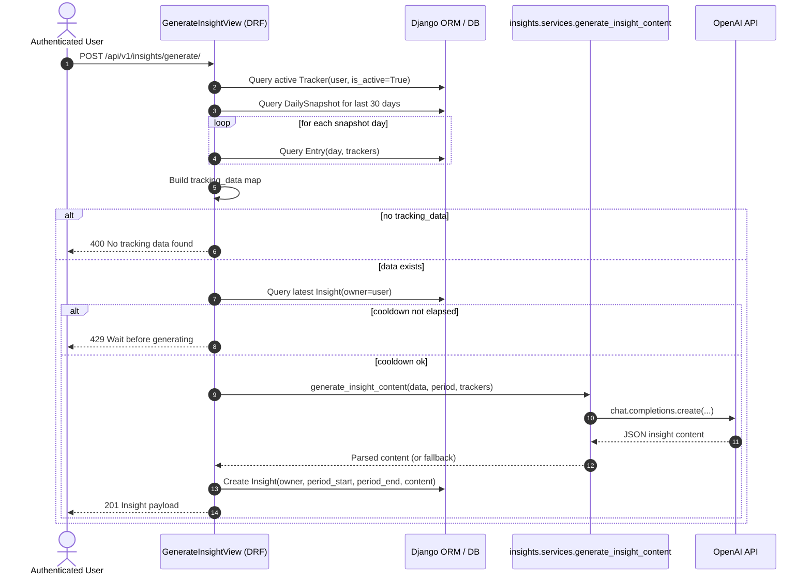
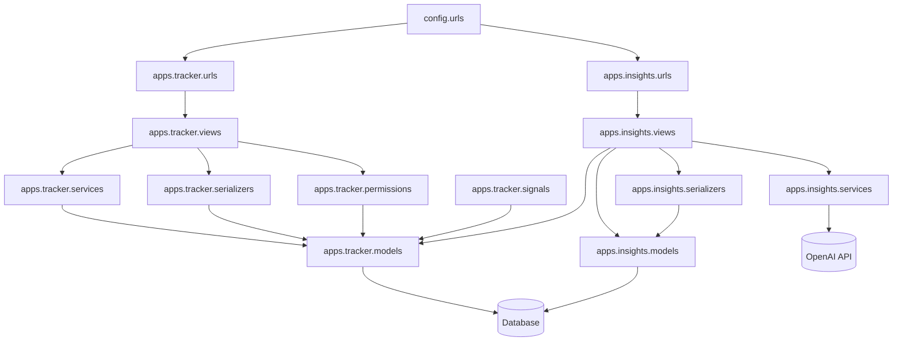

# Backend Architecture Diagrams

## Main Use Case Sequence Diagram
Primary flow: user requests insight generation (`POST /api/v1/insights/generate/`).

## Backend Component Diagram
Backend-only structural view of major modules.

